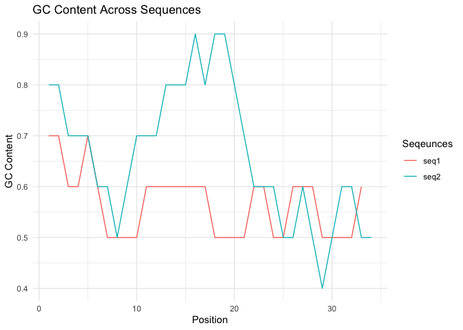
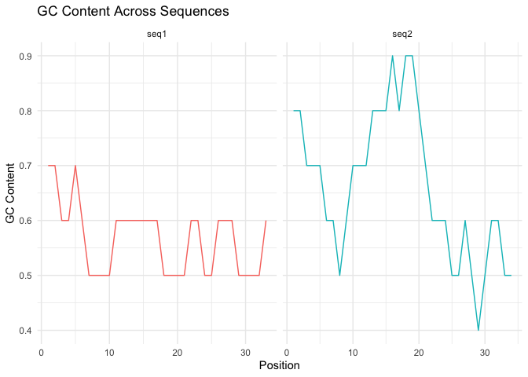

<!-- README.md is generated from README.Rmd. Please edit that file -->

# gcvisualyst

<!-- badges: start -->
<!-- badges: end -->

The goal of gcvisualyst is to analyze and visualize the GC content of
DNA sequences across sliding windows. This tool provides a simple and
effective way to calculate GC content and generate plots that illustrate
GC content variations along sequences.

Features:

- *GC Content Calculation*: Computes the GC content of DNA sequences
  across sliding windows of user-defined size.

- *Data Visualization:* Generates visualizations of GC content for
  multiple sequences, either combined in a single plot or as separate
  facets for each sequence.

- *Customizable Plots:* Provides options for combined or facet-wrapped
  layouts for easy comparison of multiple sequences.

- *Efficient Processing:* Utilizes dplyr, ggplot2, stringr, and purrr
  for efficient data manipulation and plotting.

## Installation

You can install the development version of gcvisualyst like so:

``` r
# install.packages("devtools")
devtools::install_github("woosflex/gcvisualyst")
```

## Usage

GC Visualyst can be used to generate combined plots in which all
sequences are plotted in a single graph by using `combined = TRUE`
argument in `gc_visualize()` function:

``` r
library(gcvisualyst)
## Demo DNA sequences
sequences_df <- data.frame(
  headers = c(
    "seq1", "seq2"
    ),
  sequences = c(
    "AGCTGCGCGTATCGTACGCGATCGTATCGCGATCGTATCGCG",
    "GGCGCGCTAGCTCGAGTCGCGCGGCTCGATAGCTCGTACGTAG"
  ),
  stringsAsFactors = FALSE
)

## Calculate GC content with a sliding window of 10
gc_content_df <- gc_content(sequences_df, window = 10)

## Visualize GC content
gc_visualize(gc_content_df, combined = TRUE)
```



While the other way to use the the package is to generate different plot
for all the sequences by using `combined = FALSE` argument, which is the
default parameter of the `combined` argument of `gc_visualize()`
function:

``` r
library(gcvisualyst)
## Demo DNA sequences
sequences_df <- data.frame(
  headers = c(
    "seq1", "seq2"
    ),
  sequences = c(
    "AGCTGCGCGTATCGTACGCGATCGTATCGCGATCGTATCGCG",
    "GGCGCGCTAGCTCGAGTCGCGCGGCTCGATAGCTCGTACGTAG"
  ),
  stringsAsFactors = FALSE
)

## Calculate GC content with a sliding window of 10
gc_content_df <- gc_content(sequences_df, window = 10)

## Visualize GC content
gc_visualize(gc_content_df)
```


